# Floorplaner — планировщик дома и участка

Редактор планировок в браузере: стены, окна, двери, мебель и техника в реальных размерах, несколько этажей, крыша, участок с постройками, улицы и дорожки, инженерные сети, ориентация по сторонам света, тени и инсоляция. Есть 3D-вид, проверка отступов по нормам, смета и чертежи с размерами. Экспорт в PDF, DXF (AutoCAD), SVG, IFC (BIM) и OBJ. Всё в одном HTML-файле, без сервера, без установки и без внешних библиотек.

**▶ Открыть онлайн: [msc0101.github.io/floorplaner](https://msc0101.github.io/floorplaner/)**

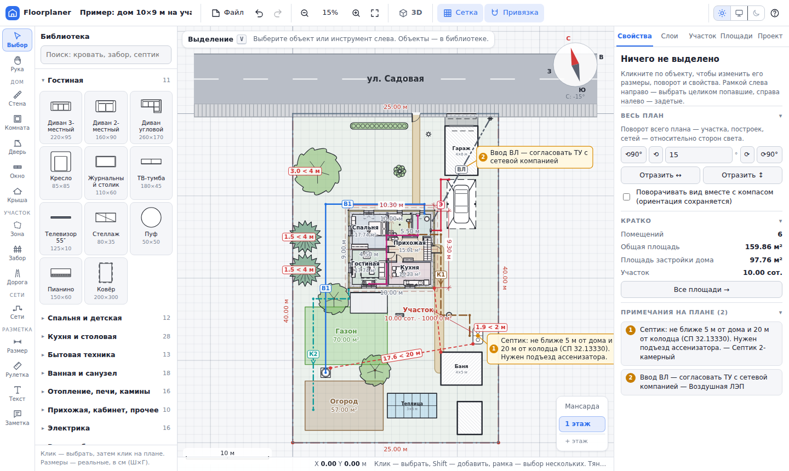

## Как запустить

* **Онлайн:** **https://msc0101.github.io/floorplaner/** — открыть в браузере, ничего не устанавливая.
* **Проще всего:** скачайте [`dist/floorplaner.html`](dist/floorplaner.html) и откройте двойным кликом. Работает офлайн.
* **Из исходников:** `npm run serve` (или любой статический сервер для папки `src/`) и откройте http://localhost:8080.
* **Пересобрать один файл:** `npm run build` (Node 18+) создаёт `dist/floorplaner.html` из `src/`.
* **Сайт на GitHub Pages** собирается сам: при каждом пуше workflow [`.github/workflows/pages.yml`](.github/workflows/pages.yml) собирает страницу с адресом `https://msc0101.github.io/floorplaner/` и выкладывает её в ветку `gh-pages`. Подтвердить права в Google Search Console и Яндекс Вебмастере можно двумя способами: HTML-файлом (положите `google….html` или `yandex_….html` в папку [`public/`](public/) — всё оттуда попадает в корень сайта) или мета-тегом (код — в **Settings → Secrets and variables → Actions** как `GOOGLE_VERIFY` / `YANDEX_VERIFY`, подходит и переменная, и секрет, и целиком тег `<meta …>`).
* **Опубликовать на своём сайте:** в странице уже есть заголовок и описание для выдачи, ключевые слова, микроразметка schema.org (`WebApplication`), Open Graph, favicon и текст в `<noscript>` для роботов Google и Яндекса. Для сайта соберите `SITE_URL=https://ваш-сайт.ru/ npm run build`. Кроме `floorplaner.html` появятся `dist/index.html` (с canonical, Open Graph и картинкой-превью), `robots.txt`, `sitemap.xml` и `og.png`. Коды подтверждения прав для Google Search Console и Яндекс Вебмастера передаются так: `GOOGLE_VERIFY=… YANDEX_VERIFY=…`. Выложите содержимое `dist/` в корень сайта (robots.txt работает только в корне домена) и добавьте sitemap в обе панели.

План автоматически сохраняется в браузере. Чтобы перенести его на другой компьютер, выберите **Файл → Сохранить (.json)**.

## Возможности

### Дом
* **Стены** трёх видов (наружные, внутренние, перегородки) и **заборы**. Толщина и высота задаются для каждого вида и для каждой стены. Углы стыкуются аккуратно, без «ступенек».
* **Материал стен:** газобетон, пенобетон, керамический блок, кирпич, ж/б, керамзитобетон, шлакоблок, арболит, брус, каркас, СИП, ГКЛ, ПГП, камень. Для заборов — профлист, штакетник, рабица и другие. На плане материал показан штриховкой, можно задать утеплитель. При смене материала толщина встаёт на ближайшую типовую (газобетон 40 → кирпич 38). Таблица **Проект → Стены по типам** меняет материал, толщину и высоту сразу у всех стен этого типа (или только у новых — галочкой). Для наружных стен считается сопротивление теплопередаче R, в ведомости — объём кладки и примерное количество блоков и кирпича.
* **Точный ввод:** во время рисования наберите длину (`350`, `3.5м`, `3500мм`) и нажмите `Enter`. Для комнаты-прямоугольника вводятся размеры вида `400x300`.
* **Привязки:** к углам, осям и граням стен, к сетке (по умолчанию 10 см), выравнивание по осям сетки, шаг угла 15° с `Shift`. `Alt` временно отключает привязки.
* **Поворот сетки:** сетку можно повернуть на любой угол (**Проект → Поворот сетки**) или поставить вдоль выделенной стены, края зоны или предмета (**Сетку — по выделенному**, есть и в контекстном меню). Тогда «ортогонально», прямоугольные комнаты, зоны и крыши строятся вдоль осей сетки, а новые предметы сразу получают её угол. При повороте всего плана сетка поворачивается вместе с ним.
* **Окна и двери** разных типов и размеров: распашные, двустворчатые, полуторные, раздвижные, арки, гаражные ворота; окна одно-, двух- и трёхстворчатые, глухие, балконные блоки. Для каждого проёма можно поменять сторону петель и направление открывания (внутрь или наружу), задать высоту и подоконник.
* **Помещения находятся автоматически** по замкнутым контурам стен. Название и площадь стоят по центру помещения; подпись можно перетащить мышью, тогда она закрепляется (вернуть — «Подпись — в центр помещения» в свойствах). Стену не обязательно дотягивать точно до оси соседней: если конец упирается в её толщину (в грань или в угол), стык засчитывается. Площадь считается по полу (за вычетом стен) или по осям.
* **Сдвиг стен:** перетащите стену (она двигается поперёк себя), нажмите стрелки (`Shift` — по 10 см) или введите «Сдвинуть на … см» в свойствах. Примыкающие стены, в том числе упёртые в середину, удлиняются и укорачиваются следом, проёмы остаются на месте.
* **Расстояния до стен** показываются при выборе предмета или проёма, поэтому расставлять мебель можно точно, а не на глаз.

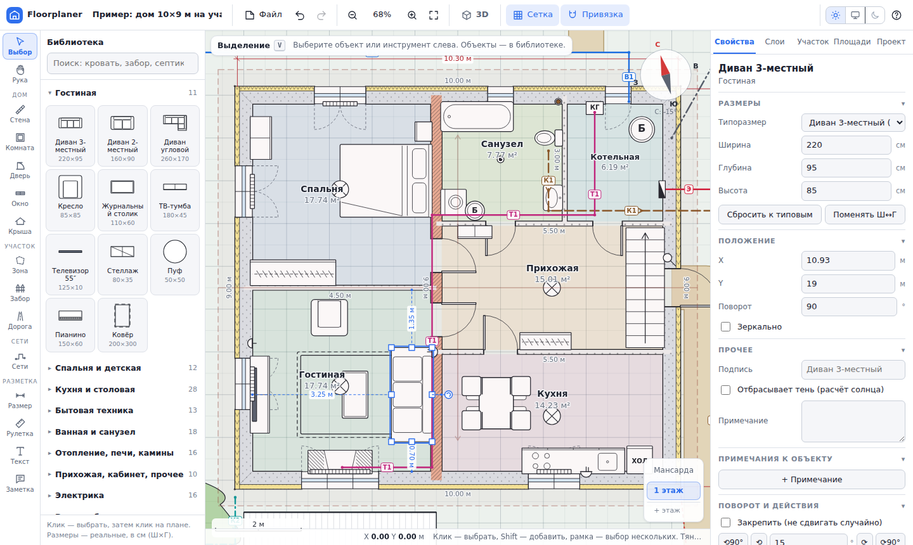

### Этажи, лестница, крыша
* **Несколько этажей:** переключатель справа внизу. «+ этаж» создаёт новый этаж и копирует на него наружные стены. Нижний этаж виден бледной подсказкой, чтобы стены совпадали. Лестница с нижнего этажа отображается на верхнем как проём.
* **Отметки и высоты этажей** задаются на вкладке «Проект». Площади считаются по каждому этажу и в сумме.
* **Крыша:** двускатная, вальмовая, односкатная или плоская. Её можно построить по контуру дома одной кнопкой (со свесом) или нарисовать прямоугольником. Задаются уклон, высота карниза, направление конька и материал кровли. Считаются площадь кровли, высота конька, длины конька, скатов, карнизов и фронтонов. Крыша учитывается в тенях.

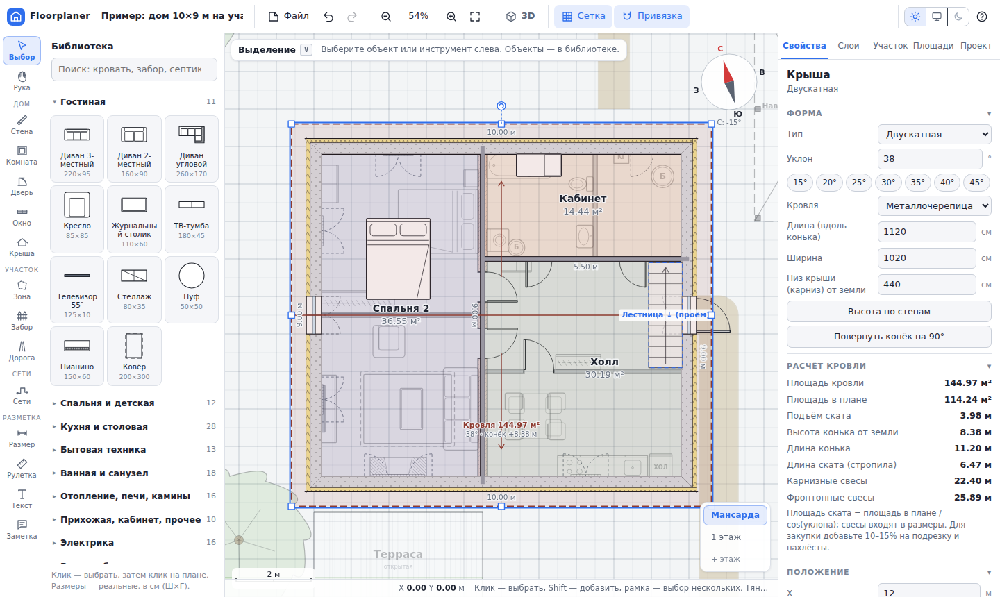

### 3D-вид
Кнопка **3D** (или клавиша `3`): модель дома со стенами, цоколем, окнами (рамы, импосты, подоконники, стекло), дверями, перекрытиями и крышей со свесами, мебелью и сантехникой, постройками, навесами, теплицами, бассейном, террасой, машинами, деревьями, кустами и живой изгородью. На участке видны заборы, дороги с бордюрами и разметкой, столбы ЛЭП с траверсами и проводами, фонари и опоры освещения.

Освещение соответствует положению солнца на выбранные дату и время, **тени считаются по карте теней** (shadow mapping), небо с градиентом и дымкой. Ракурсы в один клик: с юга, севера, востока, запада, сверху и с высоты глаз. Модель можно вращать, приближать и сдвигать, показывать или скрывать верхние этажи, крышу, мебель, участок и тени. Панель 3D сворачивается. Из 3D-вида можно сохранить картинку, OBJ или IFC.

**Прогулка от первого лица, как в CS:** в 3D нажмите `W`/`A`/`S`/`D` или стрелки (или кнопку «Прогулка»), и камера опустится на землю, на высоту глаз. `W` `S` `↑` `↓` — вперёд и назад, `A` `D` — шаг вбок, `←` `→` — поворот, левая кнопка мыши и движение — осмотреться, `Shift` — бегом, `Space` — прыжок, `C` — присесть. Сквозь стены, окна, заборы и высокую мебель не пройти, двери, арки и калитки — проходы. По ступеням крыльца и лестнице можно подняться, в том числе на следующий этаж. `PgUp`/`PgDn` — сразу на этаж выше или ниже, `N` — ходить сквозь стены, `Esc` — обратно к обзору сверху.

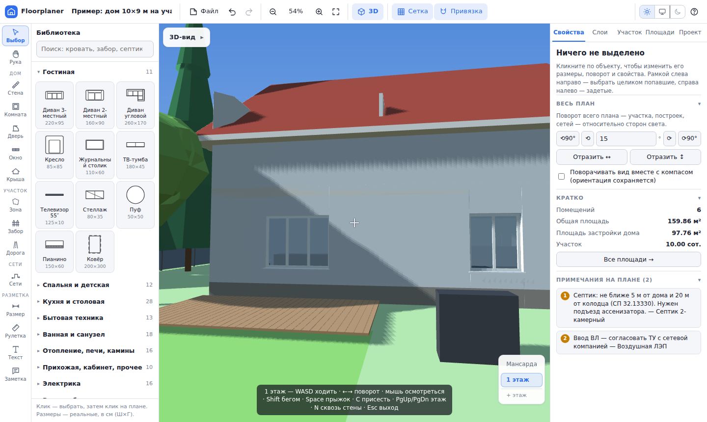

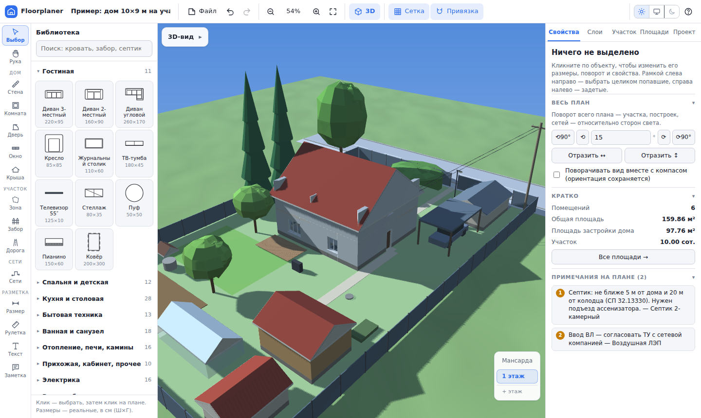

### Библиотека (реальные размеры, см)
Более 180 объектов: мебель для гостиной, спальни и прихожей; кухонные гарнитуры (прямые 120–360 см, угловые, П-образные, параллельные, с островом, с барной стойкой, с полуостровом, с пеналами — в 3D с навесными шкафами, мойкой и варочной панелью) и модули (пенал, колонна под духовку, угловой модуль, барная стойка, вытяжка); бытовая техника (холодильник, стиральная и посудомоечная машины, плита, водонагреватель); сантехника (ванны, душевые, унитазы, раковины); печи, камины, котлы, радиаторы; электрика (розетки, выключатели, светильники, щиток, столбы ЛЭП, фонари); колодцы, скважины, септики, газгольдер; гаражи, навесы для авто, сараи, бани, беседки, теплицы, бассейн; деревья, кусты, живые изгороди, грядки. Размеры любого объекта можно изменить. Мебель, поставленная у стены, сама разворачивается к ней спинкой.

### Участок
* **Граница участка** с длинами сторон и площадью в сотках, а также **зоны**: газон, огород, мощение, проезд, водоём, цветник, охранная зона.
* **Улицы, дороги, проезды, тротуары и тропинки** заданной ширины. Название пишется вдоль дороги.
* **Постройки произвольных размеров:** дом-контур, гараж, навес для авто (одно-, двухместный или пристроенный), сарай, баня, беседка, теплица.
* **Крыльцо, веранда, терраса:** открытая, с ограждением, закрытая остеклённая или закрытая утеплённая; с крышей (козырьком) или без; пристроенная к дому (односкатная крыша от стены) или отдельно стоящая (двускатная); высота площадки и ступени считаются сами (подъём, проступь); стороны со ступенями и с ограждением (остеклением, стенами) выбираются кнопками — спереди, слева, справа, сзади, ступени — по центру стороны или у края. Площадка рисуется под стенами, так что дверь, открывающаяся на крыльцо, видна. Всё настраивается в свойствах, видно на плане и в 3D; веранды под крышей идут в площадь застройки.
* **Заборы:** инструмент «Забор» (`F`) рисует забор по точкам, как стены. В библиотеке, в группе «Заборы и ворота» (поиск: «забор», «ограда»), есть заборы по материалам: профлист, евроштакетник, штакетник, дерево, рабица, ковка, кирпич, бетон. Клик по любому включает рисование этим материалом. Там же ворота, калитка и **забор по границе участка** одной кнопкой.

### Инженерные сети
Трассы водопровода (В1), ГВС (Т3), канализации (К1, со стрелками уклона), ливнёвки и дренажа (К2), отопления и тёплого пола, газа, электрокабеля, воздушной ЛЭП, слаботочки и заземления. Можно указать диаметр или марку кабеля и глубину. Трассы можно вести и по участку, и внутри дома, с привязкой к приборам. Длины суммируются в ведомости.

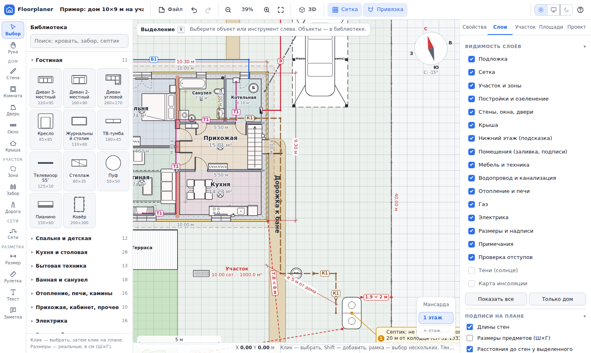

### Стороны света, солнце, тени, инсоляция
* **Ориентация на любой угол:** ползунок, точный ввод или перетаскивание компаса на плане. Можно повернуть сам участок с постройками (ручка ⟳, кнопки, ввод угла), причём поворачивается только выделенное, а без выделения — весь план.
* **Положение солнца** (алгоритм NOAA) для выбранного города или координат, даты и времени. Показываются восход, заход и долгота дня, есть анимация хода солнца за день.
* **Тени** от дома, построек, заборов, деревьев и столбов с учётом их высоты. Навесы дают тень только от кровли.
* **Карта освещённости участка:** сколько часов прямого солнца получает каждая точка за выбранный день, в среднем за сезон (апрель–август) или за год. Число часов в точке видно при наведении курсора.
* **Инсоляция помещений через окна:** непрерывная и суммарная, со сравнением с нормативом СанПиН для вашей широты.

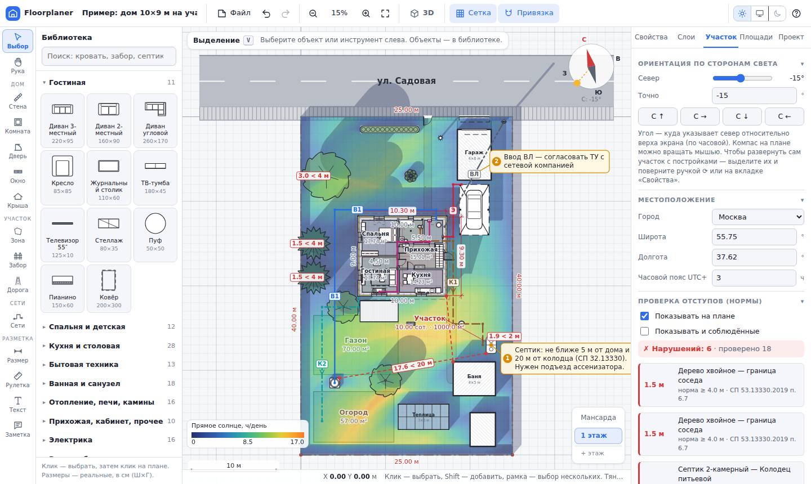

### Проверка отступов по нормам
Автоматическая проверка расстояний по СП 53.13330.2019 (пп. 6.6–6.8) и санитарным рекомендациям:
* дом — красная линия улицы (5 м) и проезда (3 м), дом — граница соседа (3 м), хозпостройки — граница (1 м);
* деревья и кустарники — граница соседа (4, 2 и 1 м);
* дом — уборная (12 м), дом — баня (8 м), колодец — уборная (8 м);
* септик — дом, колодец и граница.

Тип каждой стороны участка (сосед, улица, проезд) определяется по ближайшей дороге, его можно поменять вручную. Нарушения показываются на плане красными размерными линиями. Нормы можно изменить под местные ПЗЗ.

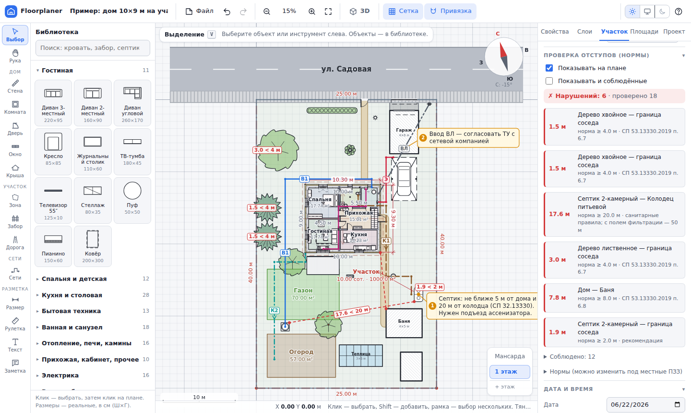

### Площади
Считаются автоматически: по каждому помещению (по полу, по осям, периметр), общая и жилая площадь, площадь застройки по наружным граням стен, площадь участка, застроенная и свободная часть, площади зон, дорог и построек. Там же — оценка материалов: длина, площадь и объём стен каждого вида за вычетом проёмов, периметр фундамента, число окон и дверей.

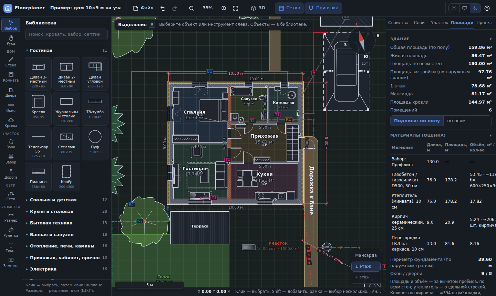

### Смета
«Файл → Смета» или вкладка «Площади». Объёмы берутся из проекта автоматически:
* фундамент по периметру, перекрытия, полы;
* стены по материалам (м³ или м²) и утеплитель;
* кровля и стропильная система;
* окна (м²) и двери (межкомнатные, входные, ворота);
* сети по видам (м);
* оборудование и постройки (шт.).

Цены редактируются: по умолчанию стоят ориентировочные значения «материал + работа» для средней полосы России. Можно добавлять свои позиции, задать процент непредвиденных расходов, выгрузить смету в CSV (Excel) или распечатать.

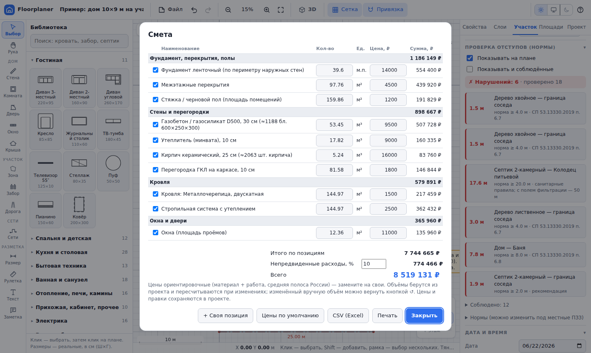

### Разметка и примечания
* **Размерные линии** и **рулетка**. Рулетка показывает длины участков, их сумму, азимут и площадь многоугольника.
* **Надписи.**
* **Примечания, привязанные к объекту:** пронумерованная выноска следует за объектом при перемещении. Её можно отметить как выполненную. Все примечания собраны в списке и попадают в печать.

### Подложка
Можно загрузить фото или скан плана (БТИ, кадастр, эскиз) и обводить его стенами. Прозрачность регулируется, подложку можно положить под план или поверх него, закрепить, переместить, повернуть и отмасштабировать. **Калибровка по двум точкам:** кликните две точки на подложке, введите реальное расстояние между ними (`6`, `6 м`, `600 см`, `6000 мм`) и нажмите `Enter`.

### Документы и экспорт
* **Чертежи с размерами** («Файл → Чертежи»): комплект листов — генплан участка и план каждого этажа. На планах этажей автоматически проставляются размерные цепочки по фасадам (проёмы, простенки, габариты) и штамп (упрощённо по ГОСТ 21.101): название, масштаб, номер листа. Масштаб подбирается отдельно для генплана и для планов. Комплект выводится в PDF (через печать), DXF или SVG, где листы идут рядом. Те же авторазмеры можно проставить на плане как обычные размеры: инструмент «Размер» → «Авторазмеры по фасадам».
* **Печать и PDF плана** на A4, A3 или A2 в масштабе «вписать» либо 1:50, 1:100, 1:200, 1:500. Второй лист — ведомости: экспликация помещений, участок и постройки, стены по материалам, сети, спецификация оборудования, условные обозначения и примечания.
* **DXF** (AutoCAD, nanoCAD, LibreCAD): формат R12, миллиметры, слои по разделам (стены, проёмы, предметы, сети, размеры, подписи и т. д.), кириллица в cp1251.
* **SVG:** векторный формат со слоями (Inkscape, Illustrator), в натуральном масштабе 1:N.
* **IFC 2x3** (BIM, Coordination View 2.0) — открытый формат, который открывают Revit, ArchiCAD, Renga, nanoCAD BIM, Tekla, BricsCAD, Solibri и BIM-просмотрщики. В модель входят:
  * участок (координаты, контур), здание и этажи;
  * стены с многослойным материалом (несущий слой и утеплитель) и свойствами (наружная/несущая, R);
  * проёмы с дверями и окнами, перекрытия;
  * помещения с названиями, площадями и периметрами;
  * крыша, мебель и оборудование, лестницы, постройки, деревья, инженерные трассы.

  Файл проверен IfcOpenShell: схема без ошибок, геометрия стен с вырезанными проёмами строится. Родные форматы RVT, PLN и RNG закрытые, поэтому для обмена используется IFC.
* **OBJ:** 3D-модель с цветами для Blender, SketchUp, Twinmotion и MeshLab.
* **PNG** плана, **JSON** проекта (подложка внутри файла), автосохранение в браузере.

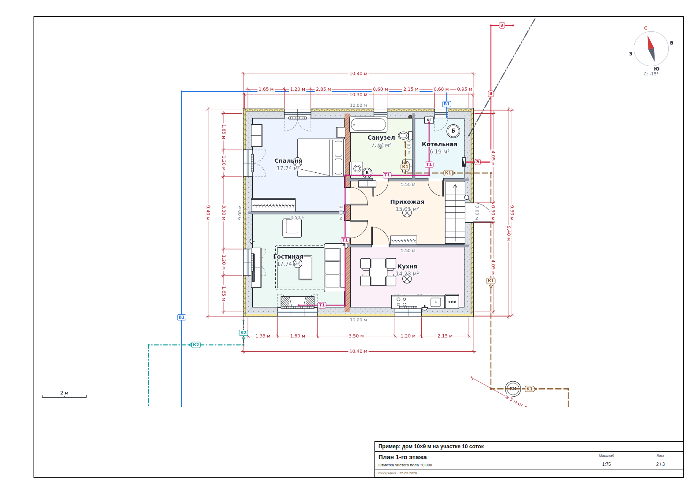

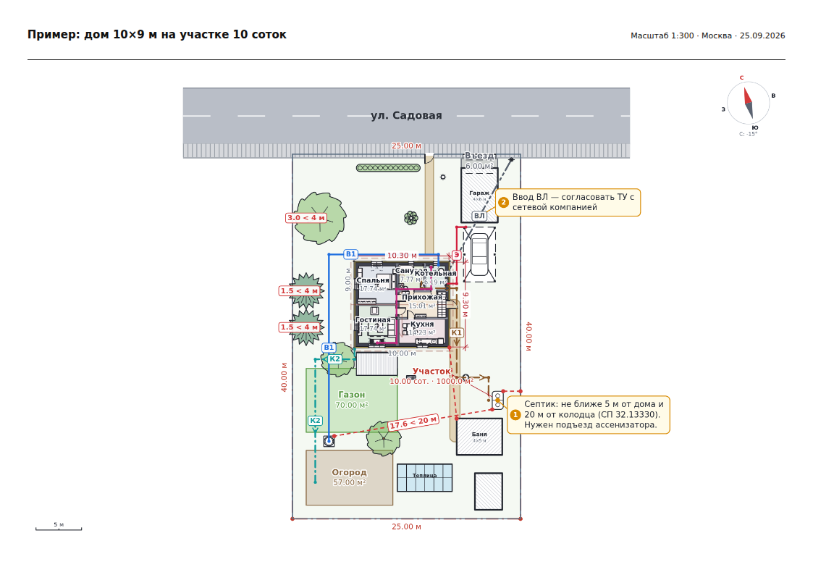

### Интерфейс
* Инструменты сгруппированы слева («Дом», «Участок», «Разметка»), рядом библиотека с поиском и миниатюрами, справа вкладки: **Свойства · Слои · Солнце · Площади · Проект**.
* Над планом — панель параметров текущего инструмента: вид стены, толщина, тип и ширина проёма, вид трассы или дороги.
* **Светлая и тёмная тема** (или как в системе).
* **Подсказки при наведении:** над объектом плана появляется карточка с его параметрами (материал и R стены, размеры, куда смотрит окно, площадь и т. д.). Отключаются на вкладке «Слои».
* Разделы панелей сворачиваются кликом по заголовку, состояние запоминается.
* **Отмена и повтор** любого действия (`Ctrl+Z` / `Ctrl+Y`), копирование и вставка, дублирование, контекстное меню по правой кнопке мыши.
* **Закрепление** объектов от случайного сдвига и **выравнивание** группы по краям или центру.
* Подписи не накладываются друг на друга: размещаются по приоритету, при нехватке места сдвигаются или скрываются.
* Работает на планшетах и телефонах (панели выезжают, масштаб щипком).

## Горячие клавиши
Полная справка открывается по `?` или `F1`.

| Действие | Клавиши |
|---|---|
| Выбор / Рука | `V` / `H`, `Пробел` |
| Стена / Комната | `W` / `Q` |
| Дверь / Окно / Крыша | `D` / `O` / `J` |
| 3D-вид / назад | `3` / `Esc` |
| 3D: прогулка — ходить / поворот | `W` `A` `S` `D`, `↑` `↓` / `←` `→`, мышь |
| 3D: бегом / прыжок / присесть | `Shift` / `Space` / `C` |
| 3D: этаж выше, ниже / сквозь стены | `PgUp` `PgDn` / `N` |
| Зона / Забор / Дорога / Сети | `B` / `F` / `P` / `U` |
| Размер / Рулетка / Текст / Примечание | `N` / `M` / `T` / `K` |
| Повернуть выделенное на 90° / 15° | `R` (`Shift+R`) / `[` `]` |
| Сдвиг на 1 см / 10 см | стрелки / `Shift` + стрелки |
| Отменить / Повторить | `Ctrl+Z` / `Ctrl+Y` |
| Копировать / Вставить / Дублировать | `Ctrl+C` / `Ctrl+V` / `Ctrl+D` |
| Сохранить / Открыть / Печать | `Ctrl+S` / `Ctrl+O` / `Ctrl+P` |
| Показать всё | `Shift+1` |

Буквенные клавиши работают и в русской раскладке.

## Структура

```
src/
  index.html        разметка интерфейса
  css/app.css       стили, светлая и тёмная темы, печать
  js/util.js        утилиты и геометрия
  js/catalog.js     каталог объектов (реальные размеры) и их отрисовка
  js/model.js       модель документа, история (undo/redo), трансформации
  js/rooms.js       поиск помещений, площади, сводка
  js/roof.js        крыши: геометрия, площадь кровли, тени
  js/sun.js         солнце, тени, карта инсоляции, инсоляция окон
  js/checks.js      проверка отступов по нормам
  js/view3d.js      3D-вид (WebGL), экспорт OBJ
  js/walk.js        прогулка в 3D от первого лица (WASD, столкновения, лестницы)
  js/render.js      темы, вид, отрисовка на Canvas, раскладка подписей
  js/tools.js       инструменты, привязки, ввод мышью и касанием
  js/ui.js          панели, свойства, библиотека, вкладки
  js/drawing.js     чертежи: авторазмеры, листы, штамп
  js/vector.js      векторный экспорт SVG и DXF
  js/bim.js         экспорт IFC 2x3 (BIM)
  js/estimate.js    смета
  js/io.js          JSON, автосохранение, PNG, печать, пример
  js/main.js        приложение, команды, горячие клавиши
tools/build.mjs     сборка в один файл dist/floorplaner.html
tools/smoke.mjs     смоук-тест в headless Chromium (npm test)
tools/screenshots.mjs  скриншоты для README
```

Единицы в модели — сантиметры. Проект — обычный JSON (`app: "floorplaner"`), его можно править и вручную.

## Проверка

```bash
npm install       # один раз: playwright для тестов (браузер: npx playwright install chromium)
npm test          # сборка + смоук-тест в headless Chromium
```
